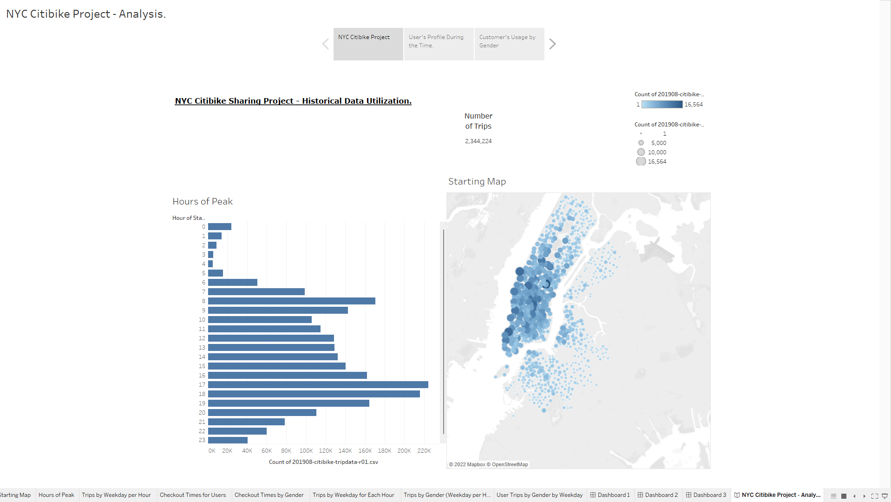
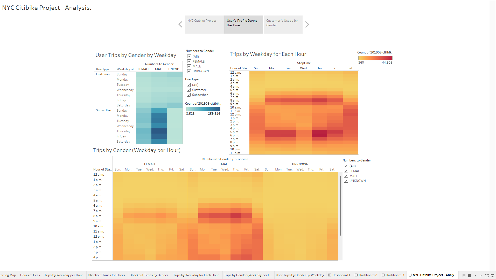
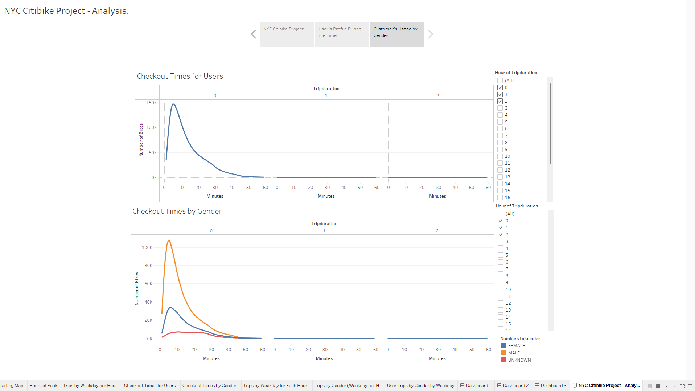

## NY Citibike with Tableau Project
[link to Project's dashboard](https://public.tableau.com/app/profile/vantuil.junior/viz/NYC_citibike_challenge_16647553065040/NYCCitibikeProject-Analysis_?publish=yes)

### Project Scope
The team performed the deliverables in this project with Tableau, one of today's most popular data visualization tools. Now, after obtaining some relevant data that can be used to help predict if the bike-share company idea could work in Des Moines. The team needed to turn to your Citi Bike data source.
As the main deliverable, the analysis scrutiny many variables such as trip duration, user's profile, genders, rental frequency, and the dimension of the market share for that type of company. Choosing Tableau as a tool, the software has a broad acceptance of the companies; it manipulates data, produces friendly visualizations, and combines multiple stories to make better reports.

### Project Deliverables
Dashboards as a result of the analysis: The first one demonstrates the historical data usage of bikes in NY city, describing the number of trips, peak hours, and distribution over the city. Starting with the title at the top left, continuing a bar graph showing the hours with high demand, and finalizing the slide with the locations highlighting the areas of concentration marked. let's see the picture below:

In the second slide, the team worked on describing the customer, filtering by gender but studying the aspects of the trip, such as demands related to weekdays and hours of each of them as characteristics.

Last but not least, the graph demonstrates the trip duration filtered by gender, focusing on the time each of them keeps using the service, providing a better comprehension of where the company must target its marketing purposes.

### Summary:
In summary, the project demonstrates that bike rentals in New York, precisely in August of 2019, had a strong performance with over two million rentals. Of course, it was observed that most of the rentals occurred during the weekdays and reached their peak around the regular commute period. This is an essential aspect due to the company's willingness to generate more profit, and the needing for transportation during predictable times yields predictable check-in and revenue. In addition, it is also interesting to note the demographic demand is largely subscriber-based, reaching fidelity customers.
However, some challenges were identified; there were a substantial amount of occasional clients, maybe due to tourists or business travellers, which changed the focus from converting them to subscribers. Also, the primary users are male, which provides a better understanding of target user types for marketing and product features in the future. However, the importance of a strategy for targeting females has been noted.